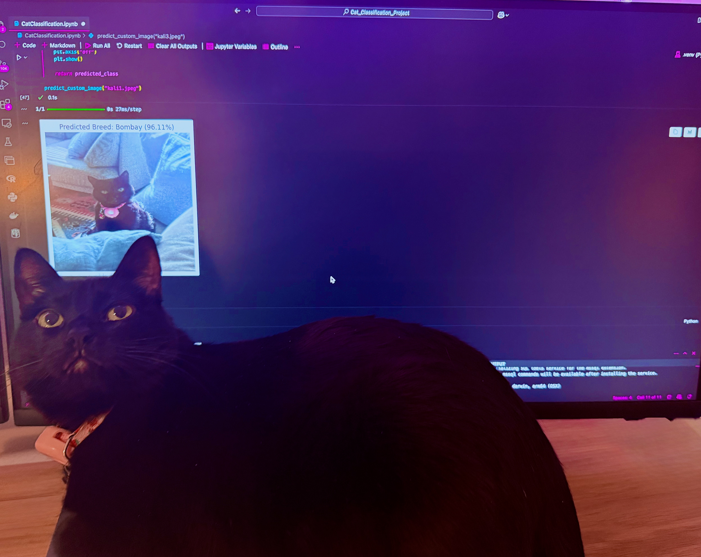

 # 🐱🐶 Pet Breed Classification Model  
### Identify the breed of a cat or dog using deep learning  
**Author:** [Megan Smith](https://www.linkedin.com/in/-megan-e-smith/)

---

## **What This Project Does**  
This project uses **deep learning** to classify images of **cats and dogs** by breed. It is trained on the **Oxford-IIIT Pet Dataset**, recognizing **37 different breeds** with high accuracy. The model leverages **MobileNetV2** for efficient and accurate classification.  

### **Key Features**
**Identifies exact cat & dog breeds** (e.g., Siamese, Beagle, Golden Retriever)  
**Uses transfer learning (MobileNetV2)** for fast, efficient training  
**Achieves ~95% training accuracy & ~90% validation accuracy**  
**Removes corrupt images before training** for cleaner data  
**Prevents overfitting** with dropout layers & data augmentation  
**Allows user to test with their own pet’s photo**  

---

## **Technologies Used**
- **[TensorFlow/Keras](https://www.tensorflow.org/)** – Deep learning framework  
- **[MobileNetV2](https://keras.io/api/applications/mobilenet/#mobilenetv2-function)** – Pre-trained model for image classification  
- **[OpenCV](https://docs.opencv.org/4.x/)** – Image preprocessing  
- **[Pandas](https://pandas.pydata.org/docs/) & [NumPy](https://numpy.org/doc/stable/)** – Data processing  
- **[Matplotlib](https://matplotlib.org/stable/contents.html)** – Visualization  
---

## **Model Performance**
**Final Accuracy:**  
**Training Accuracy:** ~95%  
**Validation Accuracy:** ~90%  

---

## **Limitations**
- This model is trained on 37 breeds, meaning that it will not be inclusive of all breeds of cats or dogs
- Many pets (and most cats) are not purebread- for mixed breeds, this model can only make a low-confidence guess based off of features in common with breeds in the dataset

---

## **Future Enhancements**
Expand dataset with **more pet breeds**  
Improve robustness with **additional data augmentation**  

---
